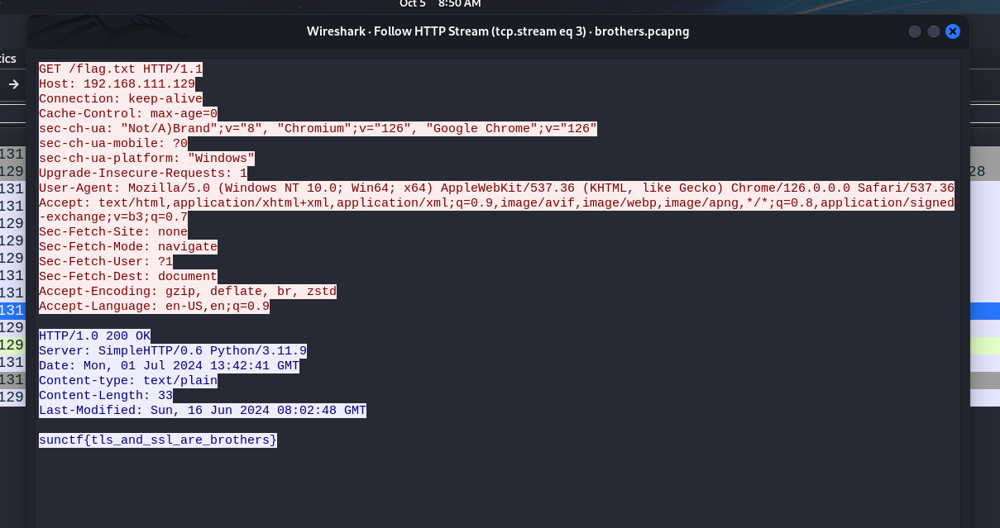

# Call for Protocols CTF Challenge Writeup

## Challenge Information
- **Name**: Call for Protocols
- **Points**: 200
- **Category**: Forensics
- **Objective**: Analyze encrypted TLS traffic to extract the flag.

## Solution

1. **Initial Investigation**:
   - Upon examining the HTTP requests, I discovered two important files: `sslkeylog.txt` and `brothers.pcapng`.
   - At first, I assumed that the `sslkeylog.txt` file was meant to decrypt the `call-of-protocols.pcapng` file, but further inspection of the protocol hierarchy suggested otherwise.

      

2. **File Analysis**:
   - I exported both files and began analyzing the `brothers.pcapng` file.
   - A closer look at the protocol hierarchy revealed a significant amount of TLS traffic, indicating that this data was encrypted and needed decryption.

      

3. **Decryption Process**:
   - To decrypt the TLS traffic, I utilized the `sslkeylog.txt` file. Navigate to **Edit** → **Preferences** → **Protocols** → **TLS** and adding the Master Secret log file.
   - After importing the key log file, the TLS traffic was successfully decrypted, and I could see that some of the encrypted packets had been converted into readable HTTP traffic.

4. **Flag Retrieval**:
   - I browsed through the decrypted HTTP traffic and located the flag within the relevant packets.

      