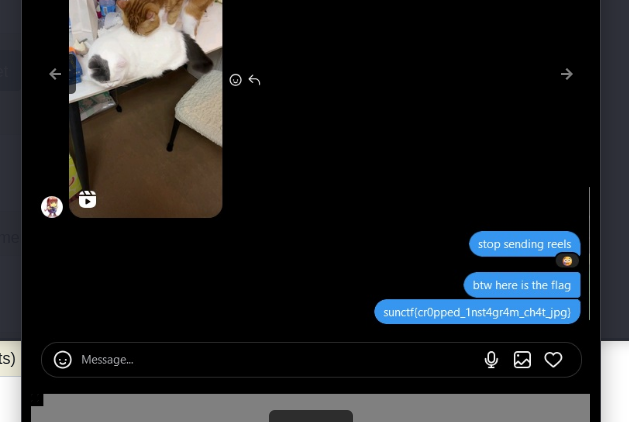

# Graded Reels CTF Challenge Writeup

## Challenge Information
- **Name**: Graded Reels
- **Points**: 150
- **Category**: Forensics
- **Objective**: Analyze an image with a partially hidden flag by manipulating its properties.

## Solution
To solve the "Graded Reels" challenge, follow these steps:

1. **Initial Inspection**:
   - Open the provided image. At first glance, it seems like the flag is partially cut off at the bottom.

2. **Using Online Tools**:
   - Attempt to use tools like [FotoForensics](https://fotoforensics.com/) to reveal any hidden or manipulated pixels at the bottom of the image.
   - Unfortunately, FotoForensics does not clearly display the hidden portion of the flag, which means you will need to manually modify the image.

      

3. **Manual Image Manipulation**:
   - Use **ExifTool** to extract the metadata of the image, including its height.
   - Once you find the height value in the metadata, convert this value from decimal to hexadecimal.

        

        

4. **Hex Editing**:
   - Open the image file in **HexEdit** (or any hex editor).
   - Locate the height value in the hex editor by searching for the hexadecimal representation of the height you found earlier.

      

5. **Modify the Image's Height**:
   - Increase the height of the image by modifying the corresponding value in the hex editor.
   - After increasing the value, save the changes to the image file.

6. **Reveal the Flag**:
   - Open the modified image, and you should now be able to see the previously hidden portion of the image, revealing the complete flag.

      