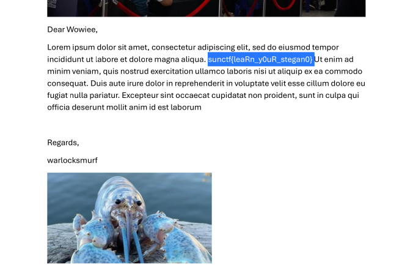

# Graduation Letter CTF Challenge Writeup

## Challenge Information
- **Name**: Graduation Letter
- **Points**: 200
- **Category**: Forensics
- **Objective**: Extract hidden information from an image, leading to a password-protected PDF, and ultimately retrieve the flag.

## Solution
To solve the "Graduation Letter" challenge, follow these steps:

1. **Initial Analysis**:
   - Open the provided image, but at first glance, it appears to be a normal image with no visible clues.

2. **Use ExifTool**:
   - Run **ExifTool** on the image to extract its metadata. 
   - This reveals a hidden password embedded within the metadata, indicating that steganography might be involved.

      

3. **Attempt Steghide**:
   - Based on the hint of a password, attempt to use **Steghide** to extract hidden data from the image.
   - However, **Steghide** fails to retrieve anything.

      

4. **Try Binwalk**:
   - Since Steghide didn’t work, use **Binwalk** to analyze the image for any embedded files.
   - Binwalk successfully extracts a **ZIP** file from the image.

      

5. **Extract and Unzip**:
   - Unzip the extracted file using the password found earlier via ExifTool. 
   - This reveals a **password-protected PDF** file.

6. **Cracking the PDF**:
   - It is hinted that **John the Ripper** can help crack the PDF’s password.
   - Use **pdf2john** to convert the PDF file into a format that John the Ripper can process.
   - Run **John** to crack the PDF password.

      

7. **Open the PDF**:
   - Use the cracked password to open the PDF, and you will find the flag inside.

      