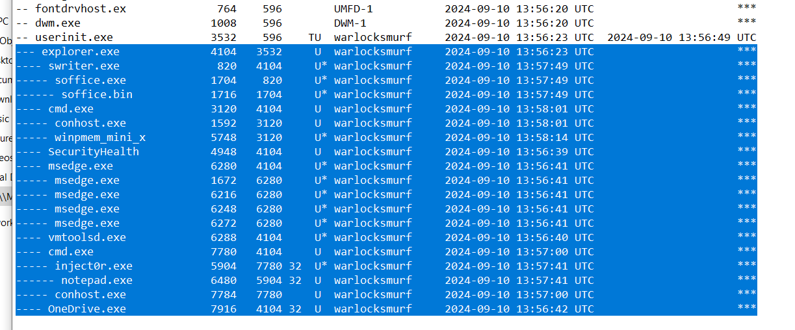

# Lost Memories 1 CTF Challenge Writeup

## Challenge Information
- **Name**: Lost Memories 1
- **Points**: 100
- **Category**: Forensics
- **Objective**: Determine the exact time when the memory dump was taken from a given memory dump file.

## Solution
To solve "Lost Memories 1", follow these steps:

1. **Overview**:
   - "Lost Memories" is a series of five challenges related to memory forensics. The challenges can be solved in any order.
   - In this specific challenge, the goal is to determine the time when the memory dump was taken.

2. **Analyzing the Memory Dump**:
   - The challenge provides a **memory dump** file.
   - I chose to analyze it using **memprocfs**, which allows mounting the memory dump as a file system.
   - Memprocfs is useful as it provides a quick overview of the system's processes, files, and other critical components, helping to piece together the system's state.

3. **Identifying the Memory Dump Timing**:
   - To find when the memory dump was created, I decided to examine the running processes in the memory dump.
   - Typically, user-initiated processes are associated with **explorer.exe** as the parent process, since most user applications are launched from the Windows Explorer interface.
   - I searched through the process tree for any unusual processes that could indicate memory dumping activity.
   - **winpmem_mini_x** stood out as a likely candidate for creating the memory dump.

      

4. **Final Flag**:
   - The flag is based on the timestamp of the memory dump, however, at the time of writing this writeup, I have already forgotten whether the flag requires the time to be in **+08:00** or **+00:00** timezone.
   - Adjust the time accordingly based on the flag format.

