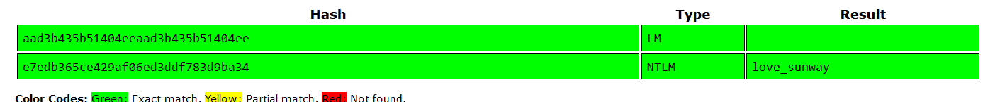

# Lost Memories 2 CTF Challenge Writeup

## Challenge Information
- **Name**: Lost Memories 2
- **Points**: 150
- **Category**: Forensics
- **Objective**: Find the password of the system user.

## Solution

1. **Overview**:
   - "Lost Memories" is a series of five challenges. This particular challenge asks us to retrieve the **system user’s password** from a memory dump.
   - From the previous challenge, we know that the system user is **warlocksmurf**.

2. **Analyzing the Memory Dump**:
   - Although I used **memprocfs** in the first challenge for quick analysis, it’s not suitable for dumping password hashes. So, I switched to using **Volatility**, which is more effective for this specific task.

3. **Dumping Password Hashes**:
   - There are two primary Volatility plugins used for extracting password hashes: **hashdump** and **lsadump**.
   - I first attempted the **hashdump** plugin:
     - This gave me the **NTLM** and **LM** hashes of the user **warlocksmurf**.
   - In case **hashdump** doesn’t work, **lsadump** is another option, but hashdump was successful in this case.

      

4. **Cracking the Password**:
   - I took the retrieved password hashes and submitted them to **CrackStation**, an online tool for cracking hashed passwords.
   - CrackStation successfully revealed the plaintext password from the NTLM hash.

5. **Submitting the Flag**:
   - The cracked password is submitted as the flag, wrapped in `sunctf{}` format.

      
