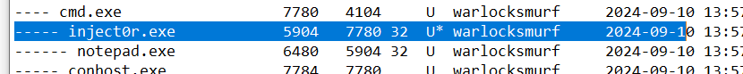

# Lost Memories 3 CTF Challenge Writeup

## Challenge Information
- **Name**: Lost Memories 3
- **Points**: 200
- **Category**: Forensics
- **Objective**: Identify the malicious process, its process ID, and its parent process ID.

## Solution

1. **Overview**:
   - "Lost Memories" is a series of five challenges that can be solved in any order. In this challenge, the goal is to find:
     - The **malicious process executable**.
     - The **process ID** (PID).
     - The **parent process ID** (PPID).

2. **Using Memprocfs**:
   - I returned to **memprocfs**, a tool I’ve used previously for memory analysis. It allows for easy navigation and process enumeration.
   - By examining the processes running on the system, I was able to identify the malicious process.

3. **Key Findings**:
   - The **malicious executable**: `inject0r.exe`.
   - The **process ID (PID)**: `5904`.
   - The **parent process ID (PPID)**: `7780`.

4. **Compiling the Flag**:
   - Using the collected information, I submitted the flag in the required format: `sunctf{}`.

      
