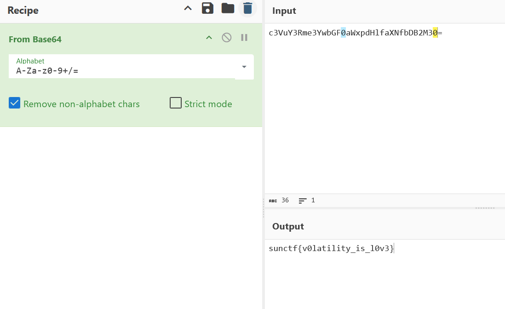

# Lost Memories 4 CTF Challenge Writeup

## Challenge Information
- **Name**: Lost Memories 4
- **Points**: 300
- **Category**: Forensics
- **Objective**: Extract the flag generated by the `inject0r.exe` file.

## Solution

1. **Challenge Overview**:
   - The goal is to extract the flag that is generated by the malicious process `inject0r.exe`. This challenge is part of the "Lost Memories" series, and solving it requires analyzing how the flag is handled during runtime.

2. **Initial Approach**:
   - I first dumped the process memory of `inject0r.exe` using **strings** in hopes of finding the flag directly in the executable's memory. This approach failed.
   - I then dumped the process memory of **notepad.exe**, which was a child process of `inject0r.exe`, suspecting the flag would be written there. Unfortunately, this also did not reveal the flag.

3. **Running the Binary**:
   - After multiple failed attempts, I decided to run `inject0r.exe` directly to observe its behavior. Initially, I thought the flag would be written to the **notepad** application, but it wasn’t.
   - Instead, I realized the flag is dynamically stored in memory during runtime, and the address changes with every execution.

      

4. **Using Cheat Engine**:
   - I launched **Cheat Engine** for runtime analysis.
   - By searching for the string `"flag"`, since it was mentioned that the flag would be stored it certain addresses.

      

5. **Final Steps**:
   - I extracted the base64-encoded flag from memory.
   - Decoded the base64 string to reveal the flag.

      