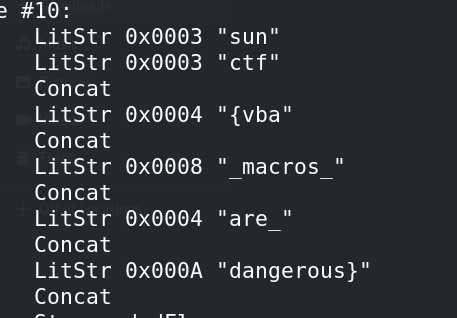

# Lost Memories 5 CTF Challenge Writeup

## Challenge Information
- **Name**: Lost Memories 5
- **Points**: 500
- **Category**: Forensics
- **Objective**: Retrieve notes hidden in the computer of a user named "warlocksmurf."

## Solution

1. **Challenge Overview**:
   - In this final challenge of the "Lost Memories" series, the task is to find specific notes hidden on warlocksmurf's computer. The challenge focuses on extracting hidden information, particularly from document files.

2. **Analyzing the Memory Dump**:
   - I began by analyzing the memory dump for relevant files. While exploring, I found some **DOCX** files, which hinted that the notes could be hidden within these documents.

      

3. **Suspecting Macros**:
   - DOCX files are often used to hide information using macros, so I suspected that the solution could involve extracting and analyzing any embedded macros in the document files.

4. **Using `olevba`**:
   - I used **olevba**, a tool for analyzing macros in Office files, to extract and review the macros in the DOCX file. The macros contained the necessary clues to recover the hidden notes.

5. **Final Steps**:
   - After reviewing the macros, I found the flag embedded within the macro scripts.
   - Retrieved the flag and submitted it in the required format.

      
