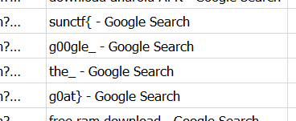

# Sussy Disk 1 CTF Challenge Writeup

## Challenge Information
- **Name**: Sussy Disk 1
- **Points**: 100
- **Category**: Forensics
- **Objective**: Analyze the disk image to recover the flag hidden in the web browsing history.

## Solution

1. **Challenge Context**:
   - *Sussy Disk* is a multi-part challenge series where each challenge involves analyzing different aspects of a disk image. In this first part, we are tasked with finding the flag by investigating web browsing history.

2. **Initial Investigation**:
   - Since this is a Windows-based challenge, I started by checking artifacts related to the default web browser, **Microsoft Edge**.
   - After examining the history files for Edge, I found that the few URLs visited were related to downloading **Google Chrome**, suggesting that Chrome was used for most of the browsing activity.

      

3. **Google Chrome Analysis**:
   - Next, I searched for Google Chrome artifacts on the disk. Chrome stores browsing history in an SQLite database located in the user profile directory.
   - Using a tool like **DB Browser for SQLite**, I navigated to Chrome's `History` file and extracted the browsing history.
   - After reviewing the visited URLs, I found the flag embedded in the browsing history.

      

4. **Conclusion**:
   - The flag was hidden in the browsing history of Google Chrome and was recovered by analyzing the browser's SQLite database.

      