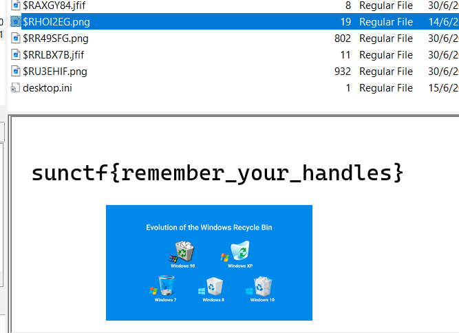

# Sussy Disk 2 CTF Challenge Writeup

## Challenge Information
- **Name**: Sussy Disk 2
- **Points**: 150
- **Category**: Forensics
- **Objective**: Recover a deleted file from the disk image.

## Solution

1. **Challenge Context**:
   - The *Sussy Disk* series continues with the second challenge, which involves recovering a deleted file from the disk image. Deleted files can often be restored from the Recycle Bin.

2. **Understanding $I and $R Files**:
   - In Windows, when a file is deleted, it is not immediately removed from the disk. Instead, it is moved to the Recycle Bin, where it is represented by two types of files:
     - **$I Files**: These are the information files that store metadata about the deleted file, such as the original filename, path, and deletion date.
     - **$R Files**: These are the actual data files that contain the content of the deleted file. They typically have the same base name as their corresponding $I files.

3. **Finding the Deleted File**:
   - I navigated to the `$Recycle.Bin` directory on the disk image, where the deleted files are stored.
   - I looked for pairs of $I and $R files to identify potential candidates for recovery. By examining the $R files, I was able to find the one corresponding to the flag.

4. **Conclusion**:
   - Clicking on the relevant $R file successfully revealed the hidden flag.

      
