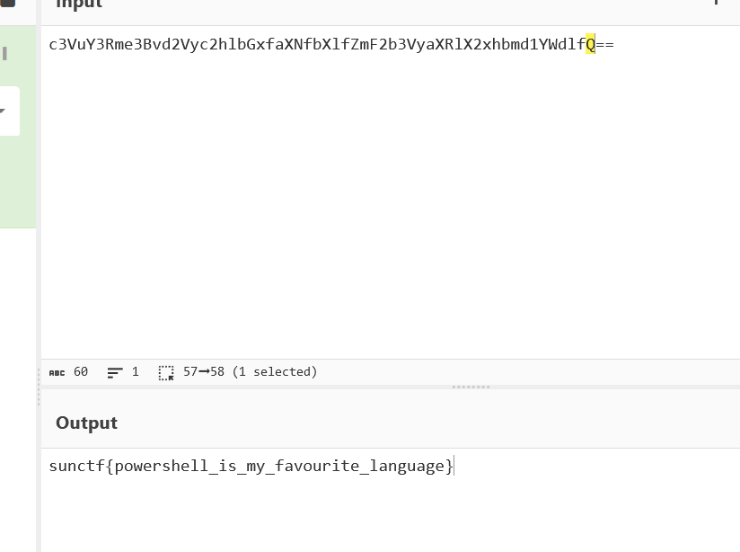

# Sussy Disk 4 CTF Challenge Writeup

## Challenge Information
- **Name**: Sussy Disk 4
- **Points**: 400
- **Category**: Forensics
- **Objective**: Unzip a password-protected zip file and retrieve the flag.

## Solution

1. **Challenge Context**:
   - This challenge is part of the *Sussy Disk* series, where the main objective is to recover information from various digital artifacts. The fourth challenge involves unzipping a password-protected zip file found in the user's document folder.

2. **Initial Investigation**:
   - Upon searching for the zip file in the documents folder, I quickly identified it but struggled to locate the password needed for extraction.
   - I spent considerable time looking for hints throughout the disk image without success.

3. **Reading the Challenge Description**:
   - After several hours, I finally took a closer look at the challenge description, which mentioned that the user frequently utilized PowerShell. This was a critical hint that led me to consider that the zip file might have been created using PowerShell's `Compress-Archive` cmdlet, which sometimes uses passwords that could be referenced in the PowerShell command history.

4. **Finding the Password**:
   - I accessed the PowerShell console history and searched through it to find any commands that could contain the password for the zip file.
   - After a thorough search, I successfully located the password used to create the zip file.

      

5. **Extracting the Zip File**:
   - With the password in hand, I used it to unzip the protected zip file. 
   - Inside the extracted contents, I found a base64 encoded message.

6. **Decoding the Flag**:
   - I decoded the base64 message using a decoding tool to retrieve the flag.

      
