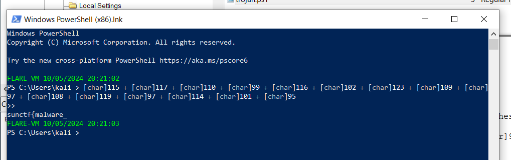
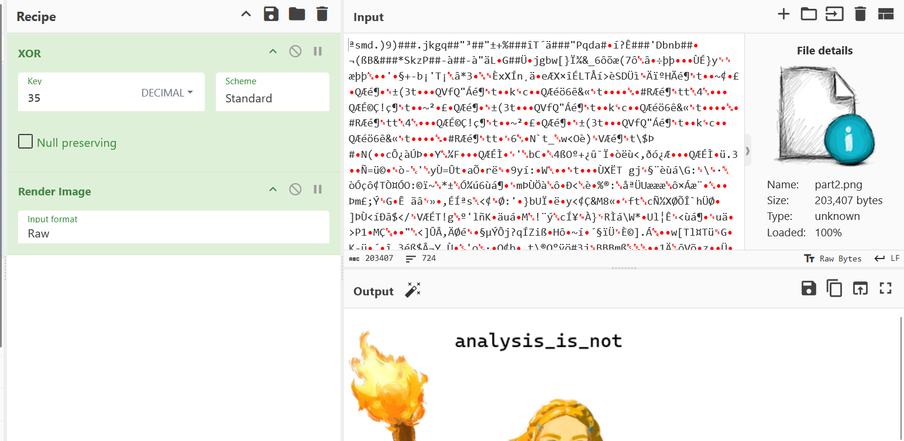
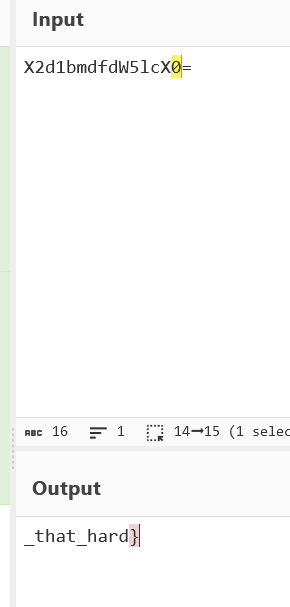

# Sussy Disk 5 CTF Challenge Writeup

## Challenge Information
- **Name**: Sussy Disk 5
- **Points**: 590
- **Category**: Forensics
- **Objective**: Find the flag through various hidden artifacts across the disk.

## Solution

1. **Challenge Context**:
   - This challenge is the final part of the *Sussy Disk* series. It involves locating a flag that is split into three parts, each hidden in different locations or formats.

2. **Finding Part 1**:
   - The first part of the flag is located in a file named `trojan.ps1`.
   - I opened this PowerShell script and found an encrypted text.
   - After decoding the encrypted text, I successfully revealed the first part of the flag.

      

3. **Finding Part 2**:
   - The second part of the flag was hidden in the `Pictures` folder.
   - In this folder, I discovered a PowerShell script responsible for encrypting an image file named `part2.png` by using an XOR operation.
   - To retrieve the second part of the flag, I had to reverse the XOR process. I XORed the encrypted image with the same key to decrypt it, revealing the second part of the flag.

      

4. **Finding Part 3**:
   - The third part of the flag was located in a text file at `warlocksmurf\AppData\Local\Temp\brainrot.txt`.
   - I navigated to the specified path and opened the `brainrot.txt` file to find the last part of the flag.

      