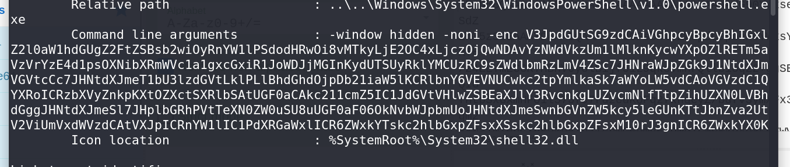
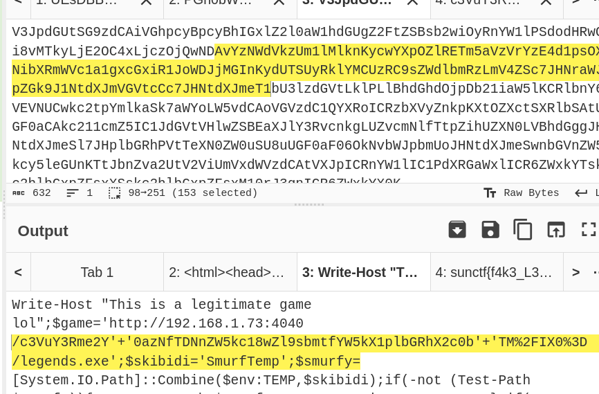
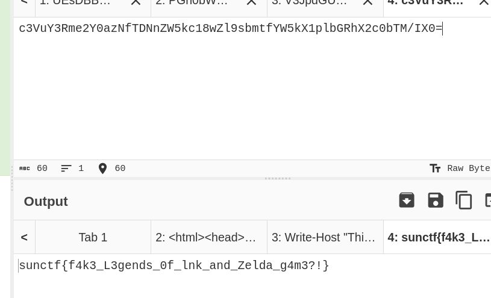

# Zelda Phishing Pond CTF Challenge Writeup

## Challenge Information
- **Name**: Zelda Phishing Pond
- **Points**: 200
- **Category**: Forensics
- **Objective**: Analyze a phishing email and extract the flag from encoded contents.

## Solution

1. **Initial Analysis**:
   - The challenge began with an email that contained encoded contents, which I needed to decode. 
   - Normally, files that are sent through email are encoded in base64 format
   - Identify where the files are and decode the files using base64

2. **Decoding Base64**:
   - Upon decoding the first chunk of Base64, I found that it revealed an HTML page. However, this did not provide any useful information related to the flag.
   - I then moved on to the second chunk of Base64, which resulted in a ZIP file.

3. **Unzipping the File**:
   - After unzipping the ZIP file, I discovered a `.lnk` file (a Windows shortcut). To extract useful information from this file, I used the `lnkinfo` tool.

4. **Extracting Data from the LNK File**:
   - Running `lnkinfo` on the `.lnk` file revealed that there were Base64 encoded messages contained within it.
   - I proceeded to decode this Base64 encoded message, which revealed a PowerShell script.

        

5. **Final Decoding**:
   - Inside the PowerShell script, there was another Base64 encoded message. I decoded this final message to uncover the flag.

        

        