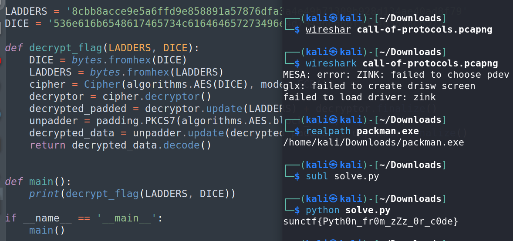

# Packman CTF Challenge Writeup

## Challenge Information
- **Name**: Packman
- **Points**: 300
- **Category**: Reverse Engineering
- **Objective**: Reverse engineer a Python-compiled Windows executable to retrieve a flag.

## Solution

1. **File Enumeration**:
   - Upon receiving the reverse engineering file, the first step was to enumerate the details.
   - The filename indicated it was a Windows executable due to the `.exe` extension.

2. **Identifying the Binary Type**:
   - By running the `strings` command on the file, I identified it as a Python-compiled executable rather than one compiled with C, C++, or Rust.
   - The presence of Python libraries and mentions of `pyc` and `pyz` in the output confirmed this.

      

3. **Decompilation Process**:
   - For Python-compiled binaries, the typical approach is to reverse it to obtain the original Python code.
   - I utilized `pyinstxtractor` to extract the `.pyc` file from the executable.
   - After obtaining the `.pyc` file, I used `pycdc` to convert the `.pyc` back into readable Python code.

4. **Flag Retrieval**:
   - With the decompiled Python code, I searched through the functions and identified one that would generate or return the flag.
   - I executed the relevant function to retrieve the flag.

      
