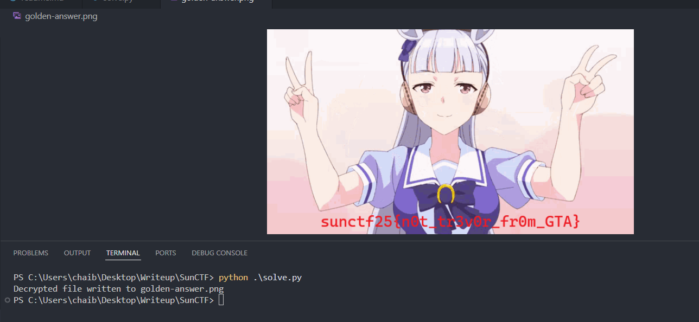

# Get Clawed - CTF Challenge Writeup

## Challenge Information
- **Name**: Get Clawed  
- **Points**: 10  
- **Category**: Forensics  
- **Objective**: Analyze a disk image and network traffic capture to uncover hidden data exfiltration techniques, reverse custom encryption mechanisms, and ultimately retrieve the attacker’s payload or flag.

---

## Solution

### 1. **Initial Recon: AD1 File**
- Given two files:
  - A forensic disk image (`.ad1`)
  - A packet capture (`.pcap`)

- Inside the AD image:
  - Nothing substantial at first glance.
  - A few anime images, some decoy files, and a suspicious file named `golden-answer.clawed`.
  - The `.clawed` file appeared to be a **custom encrypted blob** — likely containing the flag.
  - [EQCTF](https://eqctf.com/) is also mentioned 👀 in the AD1 image file. For beginners looking to get into CTF, EQCTF is a great starting point. It is created by a team of legendary Malaysian CTF players.

---

### 2. **Turning to the Network Traffic**
- With the AD1 largely unhelpful, focus shifted to the `.pcap` file.
- Suspicious HTTP GET traffic containing `?guid=` stood out — indicative of possible **C2-style communication**.
- This assumption stems from the fact that the values appeared **Base64-like**, but standard decoding failed.

---

### 3. **Leveraging Known Resources**
- After some digging, I found that my assumption was correct and it is a C2 communication.

    

- I then discovered a **writeup from the same challenge author**:  [warlocksmurf.github.io - CyberspaceCTF2024](https://warlocksmurf.github.io/posts/cyberspacectf2024/)
- The author provided a **Python script** that could be reused for decrypting similarly obfuscated C2 traffic.
- Using this script, the suspicious traffic was decrypted successfully.

    

---

### 4. **C2 Traffic Analysis**
- The decrypted content revealed:
  - A **GitHub Gist link**
  - The Gist contained **Base64-encoded content**, which when decoded turned out to be another script.
  - This script was a **basic XOR cipher**, meant to encrypt/decrypt data.

  

---

### 5. **Decrypting golden-answer.clawed**
- With the XOR script in hand, wrote a script to decrypt `golden-answer.clawed` using the same XOR logic.
- Upon decryption, the file revealed the **flag**.

    

---

## Flag
The flag for this challenge is:  
`sunctf25{n0t_tr3v0r_fr0m_GTA}`
