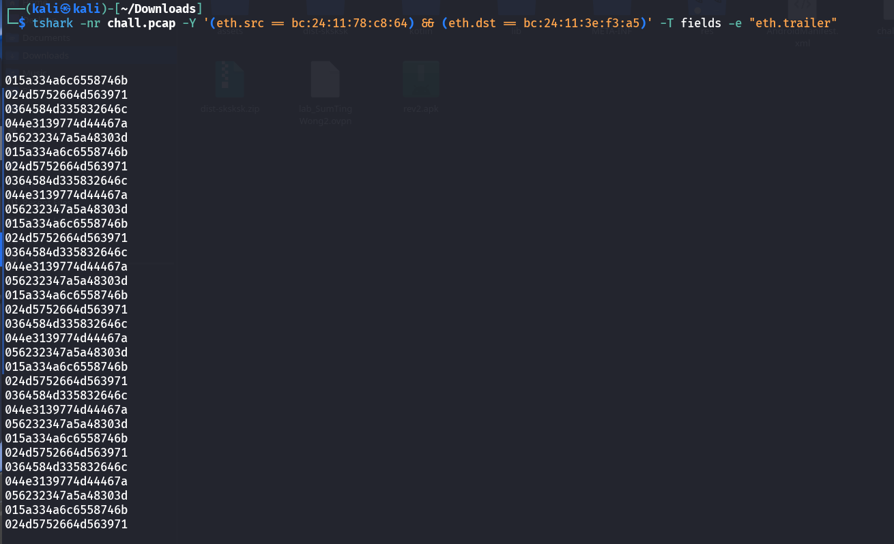
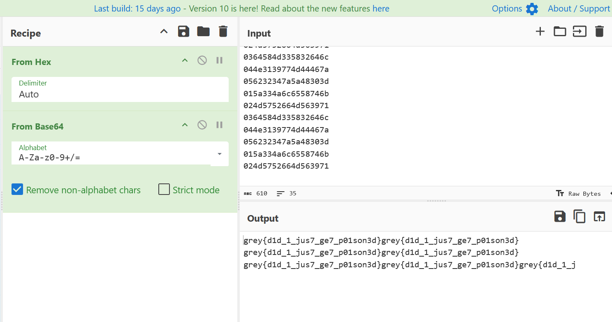

# Connection Issues CTF Challenge Writeup

## Challenge Information
- **Name**: Connection Issues  
- **Points**: 100  
- **Category**: Forensics  
- **Objective**: Analyze suspicious network traffic to identify ARP poisoning activity and extract the exfiltrated flag data.

## Solution
To solve the "Connection Issues" challenge, follow these steps:

1. **Initial Observations**:
   - The challenge involves analyzing a `.pcap` file with suspicious network behavior.
   - One of the first hints is the presence of messages like `duplicate use of <IP address> detected`, which indicates ARP spoofing or poisoning activity.
   - ARP poisoning is a technique often used to intercept traffic between devices on a network.

2. **Extracting the Flag**:
   - Used `tshark` to extract relevant data from the suspicious traffic:
     ```bash
     tshark -nr chall.pcap -Y '(eth.src == bc:24:11:78:c8:64) && (eth.dst == bc:24:11:3e:f3:a5)' -T fields -e "eth.trailer" 
     ```
   - By narrowing down the interaction, spotted an unusual pattern in the data fields.
   - Extracted payload strings contained fragments that, when reassembled, revealed the flag.


    


    

## Flag
grey{d1d_1_jus7_ge7_p01son3d}
