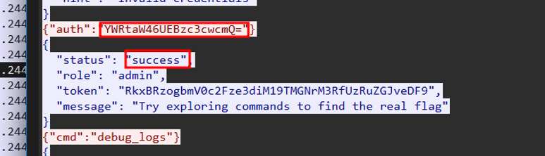

# Phantom Protocol II CTF Challenge Writeup

## Challenge Information
- **Name**: Phantom Protocol II  
- **Points**: 100  
- **Category**: Forensics  
- **Objective**: Extract the credentials used by the attacker to successfully authenticate on the server via WebSocket.

## Solution
To solve the "Phantom Protocol II" challenge, follow these steps:

1. **Context**:
   - This is the second challenge in the "Phantom Protocol" series.
   - The goal is to identify the credentials used by the attacker to log into the server via a WebSocket connection.

2. **PCAP Analysis**:
   - Trace and focus on those that involve WebSocket handshakes and data exchanges.
   - Observed multiple attempts where the attacker sends base64-encoded credentials to the server.

3. **Identifying the Successful Login**:
   - Carefully reviewed each encoded login attempt within the WebSocket data.
   - Noticed that most of them received a failure response from the server.
   - Eventually found one request that did not trigger a rejection or error, indicating a successful authentication.

4. **Decoding the Credentials**:
   - Extracted the base64 string from the successful authentication attempt.
   - Decoded it to reveal the plaintext credentials:
     ```
     admin:P@ssw0rd
     ```

      

## Flag
netsa{admin:P@ssw0rd}
