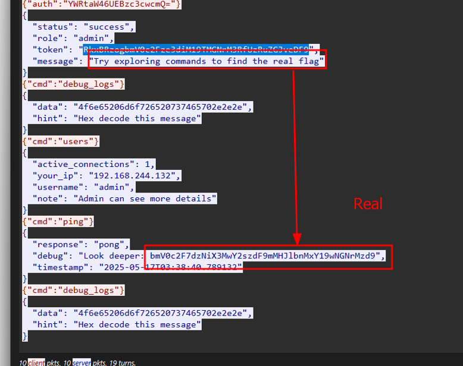
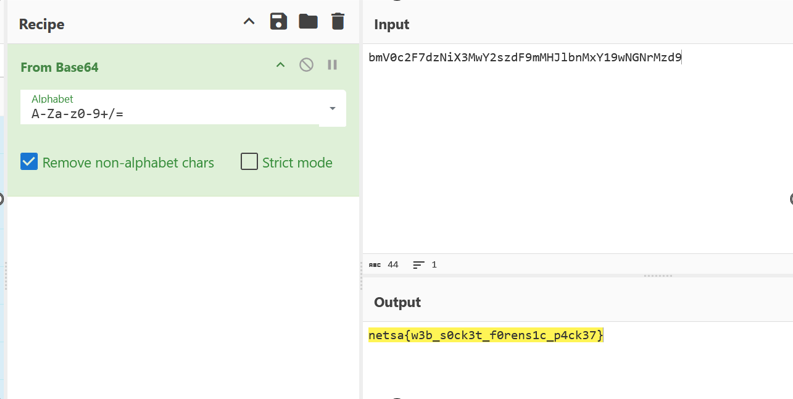

# Phantom Protocol III CTF Challenge Writeup

## Challenge Information
- **Name**: Phantom Protocol III  
- **Points**: 100
- **Category**: Forensics  
- **Objective**: Identify and extract a base64-encoded command hidden in WebSocket traffic that reveals the flag.

## Solution
To solve the "Phantom Protocol III" challenge, follow these steps:

1. **Context**:
   - This is the third challenge in the "Phantom Protocol" series.
   - The goal is to locate and decode a suspicious command transmitted via WebSocket that contains the flag.

2. **Spotting Suspicious Activity**:
   - Among several routine interactions, noticed a particular base64 string being sent in one of the WebSocket messages.
   - This payload stood out due to its formatting and context, appearing as a command being executed remotely.

3. **Decoding the Payload**:
   - Copied the base64 string and decoded it using a base64 decoder.
   - The decoded result revealed a readable plaintext string that included the flag:
     ```
     netsa{w3b_s0ck3t_f0rens1c_p4ck37}
     ```

      

      

## Flag
netsa{w3b_s0ck3t_f0rens1c_p4ck37}
