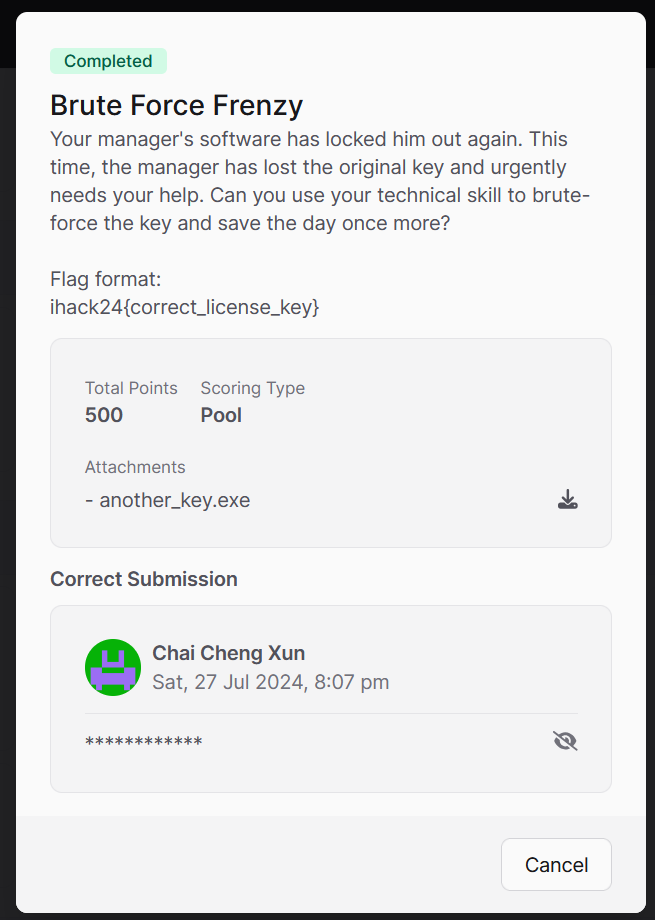
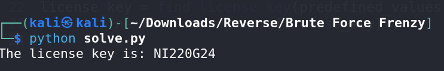

# Brute Force Frenzy CTF Challenge Writeup

## Challenge Information
- **Name**: Brute Force Frenzy
- **Points**: 500
- **Category**: Reverse Engineering
- **Objective**: Reverse engineer a binary to find the correct key for verification.



## Solution
To solve the "Brute Force Frenzy" challenge, follow these steps:

1. **Analyze the Binary**:
   - Use Ghidra to analyze the provided file. Identify the key verification process and how the key is checked against a predefined array.


         


        

2. **Understand the Obfuscation**:
   - Discover that the byte array used for verification is obfuscated. Only every 4th byte in the array is relevant for the key.

3. **Extract and Recreate**:
   - Extract the useful bytes from the obfuscated array.
   - Recreate the key verification logic in Python using these extracted bytes.


        ```python
        def find_license_key(predefined_values, target_sum):
            license_key = []
            for i in range(8):
                found = False
                for c in range(32, 127):  # Printable ASCII characters
                    iVar1 = ((c * (i + 1) + 13) % 97)
                    if iVar1 == predefined_values[i]:
                        license_key.append(chr(c))
                        found = True
                        break
                if not found:
                    return None  # If no valid character is found

            if len(license_key) == 8:
                computed_sum = sum(((ord(license_key[i]) * (i + 1) + 13) % 97) for i in range(8))
                return ''.join(license_key)
            return None

        # Example usage:
        predefined_values = [91, 62, 66, 19, 59, 51, 72, 41]
        target_sum = 200  # Replace with the actual target sum value
        license_key = find_license_key(predefined_values, target_sum)
        print(f"The license key is: {license_key}")
        ```

4. **Run the Script**:
   - Execute the Python script to test the key verification process. Obtain the flag from the script output.


        


5. **Flag**: **ihack24{NI220G24}**
