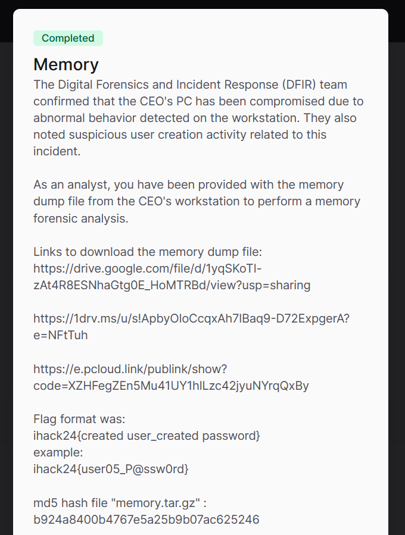
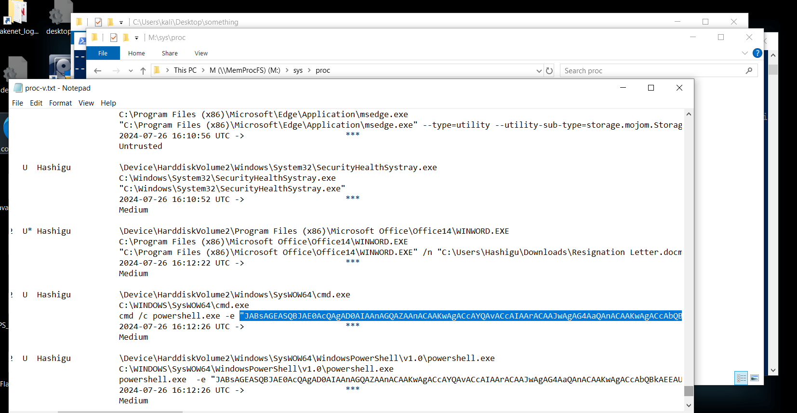
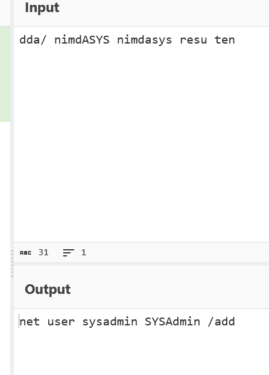

# Memory CTF Challenge Writeup

## Challenge Information
- **Name**: Memory
- **Points**: 500
- **Category**: DFIR (Digital Forensics and Incident Response)
- **Objective**: Identify the user that was created based on a memory dump from a Windows system.

## Solution
To solve the "Memory" challenge, follow these steps:

1. **Initial Setup**:
   - We are tasked with finding the user created on a Windows system based on a memory dump.
   - Given the filename suggests a Windows environment, use `memprocfs` to streamline the analysis of the memory dump, avoiding manual extraction with tools like Volatility.

2. **Analyzing Powershell Commands**:
   - Navigate to `/sys/proc/proc-v.txt` within `memprocfs` to locate and review PowerShell commands executed during the memory capture.
   - Search for commands that involve executing base64 encoded strings.

      

3. **Decoding Base64 Commands**:
   - Identify and extract the base64 encoded strings from the PowerShell commands.
   - Decode the base64 strings to reveal the underlying PowerShell commands.

      

4. **Executing and Reversing PowerShell Commands**:
   - Run the decoded PowerShell commands to reveal their functionality.
   - Analyze the output to determine which user was created.

      

5. **Finding the Flag**:
   - With the user information identified from the PowerShell commands, make the flag 

      

6. **Flag**: **ihack24{sysadmin_SYSAdmin}**