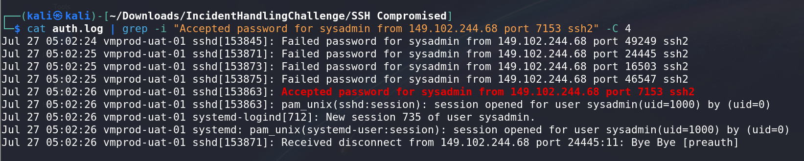

# SSH Compromised CTF Challenge Writeup

## Challenge Information
- **Name**: SSH Compromised
- **Points**: 500
- **Category**: Incident Handling
- **Objective**: Analyze a large log file to identify a compromised SSH login.

## Solution
To solve the "SSH Compromised" challenge, follow these steps:

1. **Initial Analysis**:
   - Start by examining the large log file provided for clues regarding SSH logins.

2. **Filtering the Log File**:
   - Reduce the amount of noise in the log file by removing lines containing common failure and error messages:
     - **Remove lines with**: "fail"
     - **Remove lines with**: "error"
     - **Remove lines with**: "invalid"
     - **Remove lines with**: "unknown"
     - **Remove lines with**: "closed" and "disconnect"
     - **Remove lines with**: "ignoring"
     - **Remove lines with**: "reset" and "unable"

      

      

      

3. **Identifying Successful Logins**:
   - After filtering, focus on the remaining lines to identify successful logins.
   - Search for entries related to the user `sysadmin`.

        

4. **Extracting Relevant Information**:
   - From the filtered results, find entries showing successful logins for the user `sysadmin`.
   - Identify the IP address associated with these logins. In this case, the IP address is `149.102.244.68`.

5. **Finding the Flag**:
   - Use the extracted IP address and user information to locate the flag related to the SSH compromise.

      

6. **Flag**: **ihack24{149.102.244.68_sysadmin}**