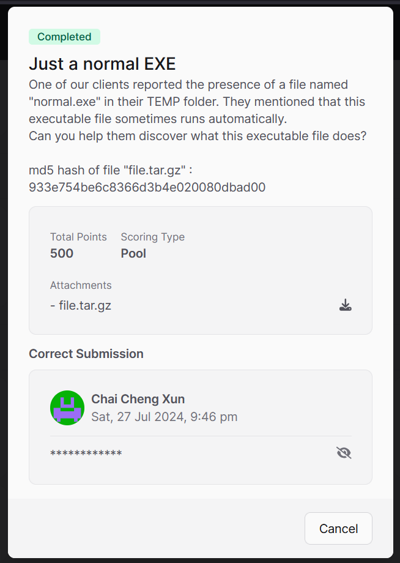
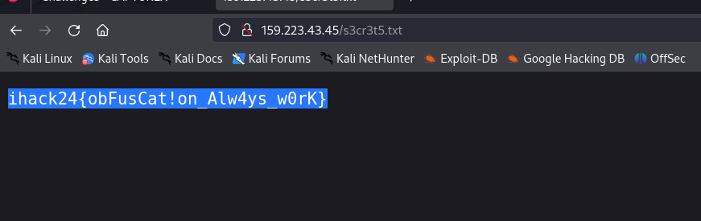

# Just A Normal EXE CTF Challenge Writeup

## Challenge Information
- **Name**: Just A Normal EXE
- **Points**: 500
- **Category**: Meoware
- **Objective**: Analyze a malware file to find the flag.

## Solution
To solve the "Just A Normal EXE" challenge, follow these steps:

1. **Initial Analysis**:
   - Used VirusTotal to scan the provided malware file. This helps to get a preliminary analysis and detect any immediate issues.

2. **Review VirusTotal Results**:
   - Access the detailed report from VirusTotal, available [here](https://www.virustotal.com/gui/file/01eeac6d706e078645f78e100bf6c2d808a443c4d85b3257b63fa087eef228cc/relations).

3. **Identify Key Findings**:
   - In the VirusTotal output, we found `s3cr3t5.txt` file mentioned in the relations.

4. **Access the Flag**:
   - Visit the URL associated with `s3cr3t5.txt` to retrieve the flag.

      

5. **Flag** : **ihack24{obFusCat!on_Alw4ys_w0rK}**