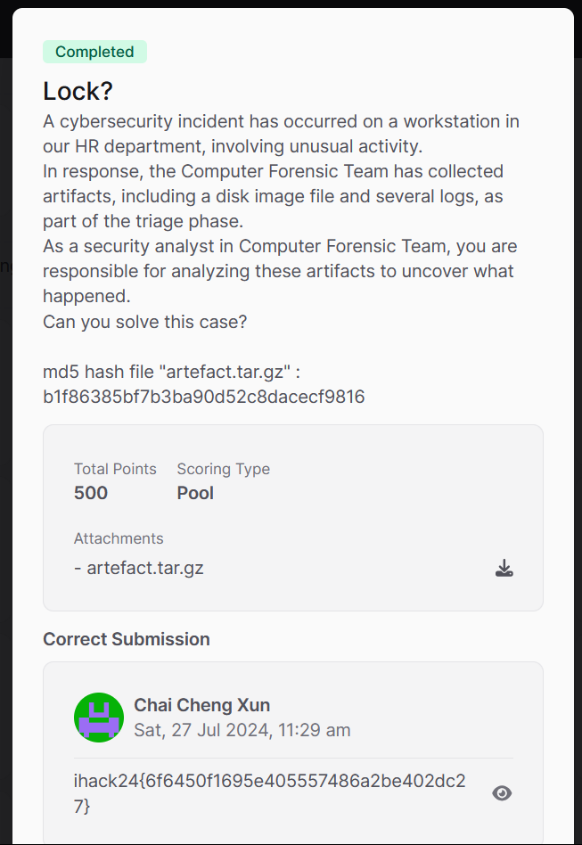
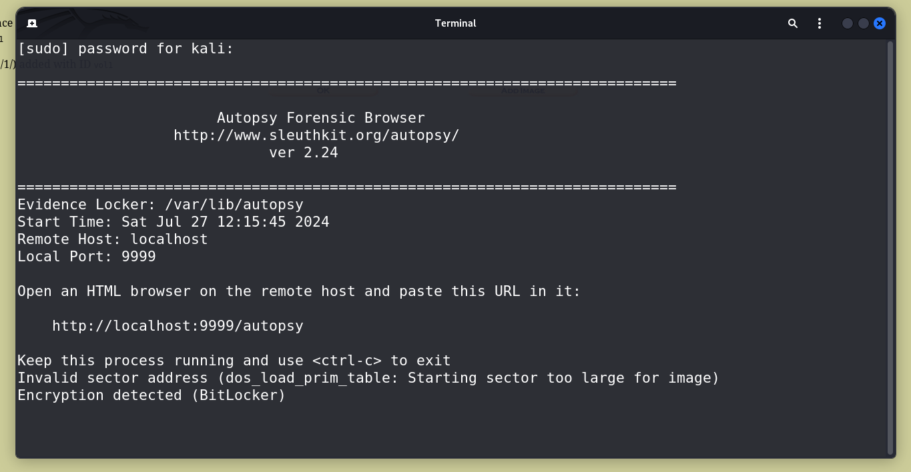
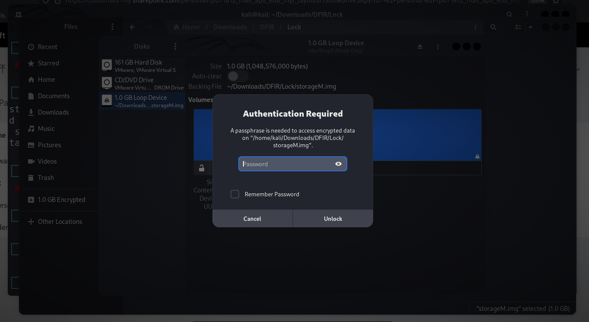
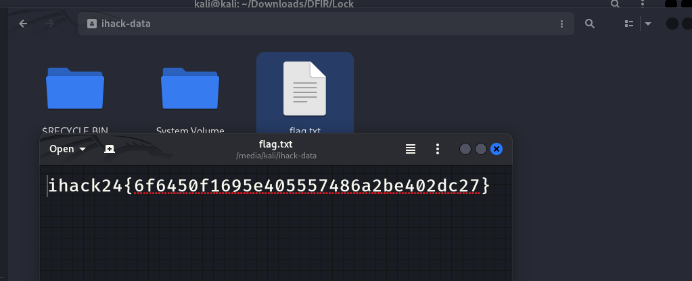

# Lock? CTF Challenge Writeup

## Challenge Information
- **Name**: Lock?
- **Points**: 500
- **Category**: DFIR (Digital Forensics and Incident Response)
- **Objective**: Recover the flag from a BitLocker-encrypted disk image by analyzing logs and decrypting the image.

## Solution
To solve the "Lock?" challenge, follow these steps:

1. **Initial Analysis**:
   - We are provided with multiple files, including various event logs.

2. **Analyzing Event Logs**:
   - Use Hayabusa to analyze the `.evtx` files.
   - Although Hayabusa didn’t provide extensive results, it revealed a password useful for decrypting the BitLocker image.

      

3. **Handling the Disk Image**:
   - The `.img` file is identified as a DOS file based on the `file` command output.
   - Attempt to mount the image using Autopsy, but encounter an error indicating that it is a BitLocker-encrypted volume.

      

      

4. **Mounting the Disk Image**:
   - Research shows that double-clicking the `.img` file on Linux can automatically mount the disk.
   - Enter the password obtained from the logs to unlock and mount the encrypted disk image.

      

5. **Extracting the Flag**:
   - Once the disk is mounted, navigate through the filesystem to locate the flag.
   - Retrieve the flag from the accessible filesystem.

      

6. **Flag**: "ihack24{6f6450f1695e405557486a2be402dc27}"