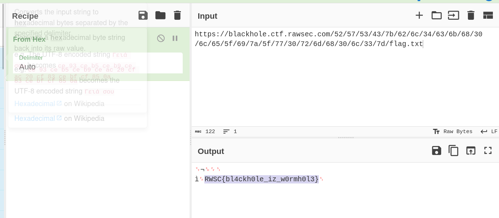

# BlackHole CTF Challenge Writeup

## Challenge Information
- **Name**: BlackHole
- **Points**: 380
- **Category**: Web
- **Objective**: The objective of the BlackHole challenge is to find the flag hidden within the URL or the web page's content.

## Solution
To solve the BlackHole CTF challenge, follow these steps:

1. **Initial Assessment**:
   - Identified that the challenge seemed the same as the preliminary one.

2. **Script Adaptation**:
   - Utilized a script from a writeup from that day.
   - Adapted the script to suit my needs for the challenge.

      ```python
      import requests
      from bs4 import BeautifulSoup
      from urllib.parse import urljoin, urlparse, unquote

      visited_links = set()

      def get_links(url):
          try:
              response = requests.get(url)
              soup = BeautifulSoup(response.text, 'html.parser')
              links = soup.find_all('a', href=True)
              return [urljoin(url, link['href']) for link in links]
          except requests.exceptions.RequestException as e:
              print(f"Error retrieving links from {url}: {e}")
              return []

      def is_directory(soup):
          return not "No directories found." in soup.get_text() and soup.find_all(class_="directory-link")

      def visit_links_recursive(url):
          if url in visited_links:
              return

          parsed_url = urlparse(url)
          base_domain = "blackhole.ctf.rawsec.com"

          if parsed_url.netloc != base_domain:
              return

          print(f"Visiting: {unquote(url)}")

          try:
              response = requests.get(url)
              soup = BeautifulSoup(response.text, 'html.parser')

              if is_directory(soup):
                  print(f"Directory found: {url}")

              visited_links.add(url)

              links = get_links(url)

              for link in links:
                  visit_links_recursive(link)

          except requests.exceptions.RequestException as e:
              print(f"Error visiting {url}: {e}")

      def main():
          starting_url = 'https://blackhole.ctf.rawsec.com/'
          visit_links_recursive(starting_url)

      if __name__ == "__main__":
          main()
      ```

3. **Flag.txt Extraction**:
   - Used the adapted script to find a flag.txt file.
   - However, the flag was not directly found in the flag.txt file.


        

4. **Rereading the URL**:
   - Revisited the challenge's instructions to reread the URL.


        

5. **CyberChef Analysis**:
   - Analyzed the URL using CyberChef.
   - Discovered the flag hidden within the URL.


      