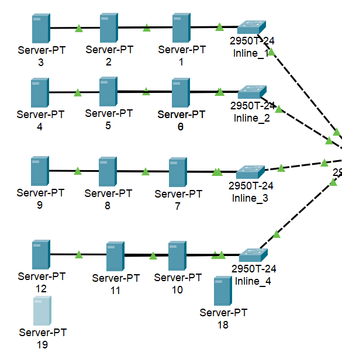
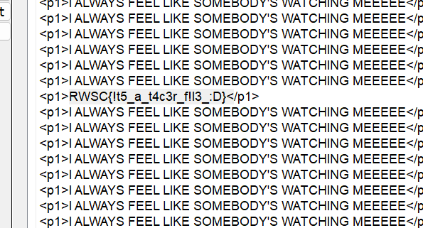

# I Hope You Have The Software CTF Challenge Writeup

## Challenge Information
- **Name**: I Hope You Have The Software
- **Points**: 230
- **Category**: Network
- **Objective**: The objective of this challenge is to find the flag hidden in the HTML files served by the servers in the packet capture.

## Solution
To solve the "I Hope You Have The Software" CTF challenge, follow these steps:

1. **Initial Assessment**:
   - Analyzed the packet capture and identified 12 servers.
   - Noticed two servers stacked on top of each other, suggesting a hidden layer.

      

2. **HTML File Analysis**:
   - Inspected the HTML files served by the servers.
   - Found the flag hidden within one of the HTML files.

3. **Flag Extraction**:
   - Extracted the flag from the HTML file.

      
