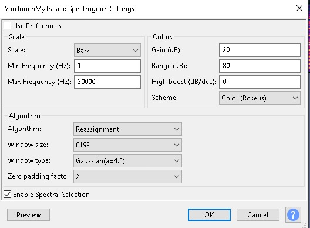

# ButterCup CTF Challenge Writeup

## Challenge Information
- **Name**: ButterCup
- **Points**: 490
- **Category**: Misc
- **Objective**: The challenge involves extracting three parts of the flag from a video, with two parts embedded in the video itself and one part hidden in the audio spectrum.

## Solution
Here's a detailed solution for the ButterCup CTF challenge:

1. **Initial Assessment**:
   - Without hints, we definitely cannot solve this challenge.
   - We were told that there were three parts to the flag, with two parts embedded in the video and one part hidden in the audio spectrum.

2. **Video Analysis**:
   - Went through the video multiple times, including adjusting playback speed and brightness to catch any hidden elements.
   - Discovered the words `3XP3RT_` at around 14 seconds and `1N_` at around 2:52 in the video.

      

      

3. **Audio Spectrum Analysis**:
   - Used audacity on the audio of the video to reveal hidden patterns.
   - Configured the spectrogram to enhance visibility of subtle details.
   - Found a hint for the last part of the flag in the spectrogram.
   - Not the clearest picture of the last part, but we were able to deducde its `4UD1O`.

      

      

4. **Flag Reconstruction**:
   - Combined the three parts of the flag obtained from the video and audio spectrum to reconstruct the complete flag.

5. **Conclusion**:
   - The ButterCup CTF challenge required a thorough analysis of both the video and audio spectrum to extract all parts of the flag. It demonstrated the importance of attention to detail and the use of specialized tools for multimedia analysis in CTF challenges.