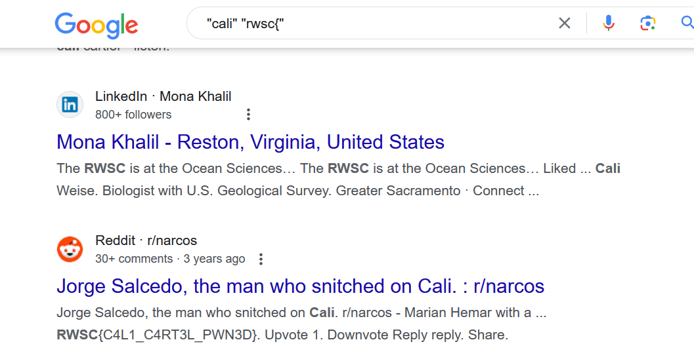

# Cali Cartel CTF Challenge Writeup

## Challenge Information
- **Name**: Cali Cartel
- **Points**: 50
- **Category**: OSINT (Open-Source Intelligence)
- **Objective**: The challenge requires finding a flag using OSINT techniques.

## Solution
Here's a brief overview of the solution for the Cali Cartel CTF challenge:

1. **Initial Approach**:
   - Initially attempted to solve the challenge using traditional OSINT techniques.

2. **Alternative Solution**:
   - But when we saw many players are solving it and we aren't, we resorted to the most retarded way of solving CTF ever, Google Dorking.

3. **Google Dorking**:
   - Applied Google dorking techniques to search for information related to the challenge.
   - Discovered relevant information that led to the flag.

4. **Flag Acquisition**:
   - Obtained the flag using the information found through Google dorking.

        

## Conclusion
The Cali Cartel challenge was solved using an alternative approach of Google dorking after traditional OSINT techniques did not yield the desired results. Google dorking helped discover information that ultimately led to finding the flag.