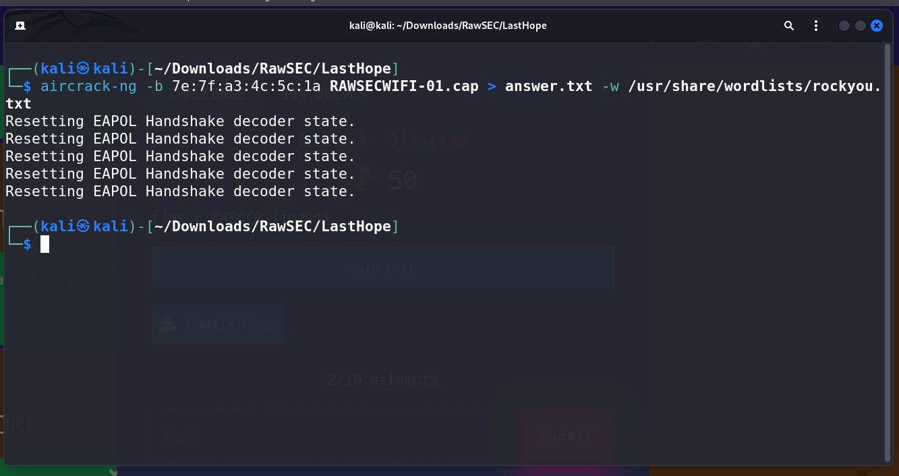
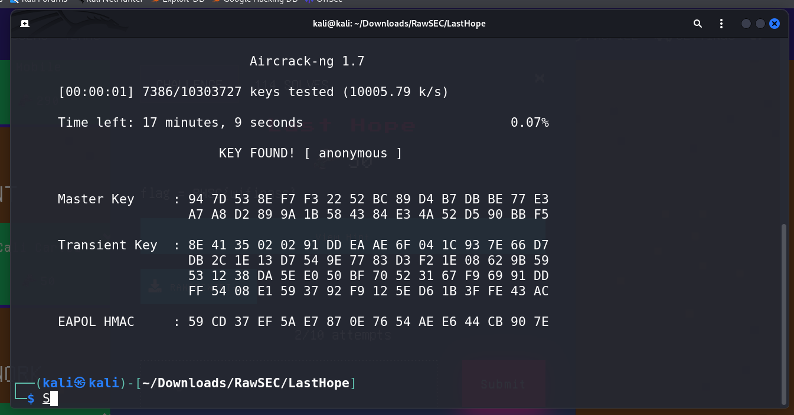

# LastHope CTF Challenge Writeup

## Challenge Information
- **Name**: LastHope
- **Points**: 50
- **Category**: Network
- **Objective**: The challenge involves cracking a WiFi password using captured WiFi packets.

## Solution
Here's a step-by-step solution for the LastHope CTF challenge:

1. **Capturing WiFi Packets**:
   - Loaded the provided file in Wireshark to analyze the network traffic.
   - Observed a large number of 802.11 packets, indicating WiFi traffic.

        

2. **Identifying Access Point MAC Address**:
   - Identified the MAC address of the access point, which can be used to crack the WiFi password.
   -  Identified the SSID of the WiFi network as "Rawsec Command Centre."

        

3. **Cracking WiFi Password**:
   - Used a tool like Aircrack-ng with the rockyou.txt wordlist to crack the WiFi password associated with the captured packets.

        

4. **Obtaining the Flag**:
   - The cracked WiFi password is the flag for this challenge.

        

## Conclusion
The LastHope challenge required participants to crack a WiFi password using captured network packets. By analyzing the packets in Wireshark and using tools like Aircrack-ng with wordlists, participants could obtain the flag associated with the cracked WiFi password.
