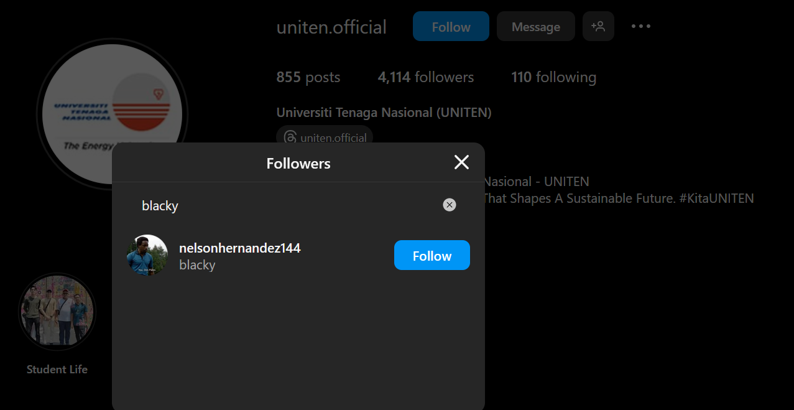
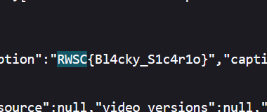

# Medellín Cartel CTF Challenge Writeup

## Challenge Information
- **Name**: Medellín Cartel
- **Points**: 190
- **Category**: OSINT (Open-Source Intelligence)
- **Objective**: The challenge involves finding a flag related to a person named Blacky on a specific Instagram page.

## Solution
Here's a step-by-step solution for the Medellín Cartel CTF challenge:

1. **Hint Analysis**:
   - We definitely used the hints in this challenge which directed us to find information about Blacky on a specific Instagram page.

2. **Investigating Blacky's Instagram Page**:
   - Visited the Instagram page mentioned in the hint.
   - Found that Blacky's page has only 1 follower and 1 post.

        

3. **Inspecting the Post**:
   - Inspected the single post on Blacky's page.
   - Discovered the flag hidden within the post's content.

4. **Obtaining the Flag**:
   - Extracted the flag from the post's content.

        

## Conclusion
The Medellín Cartel challenge required participants to investigate a specific Instagram page to find information about a person named Blacky. By inspecting Blacky's post on the page, participants could discover the flag hidden within the post's content.