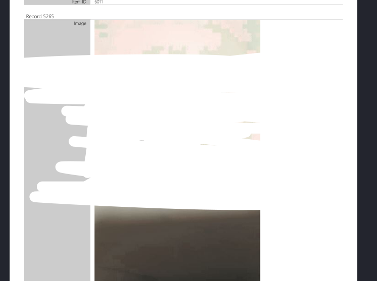
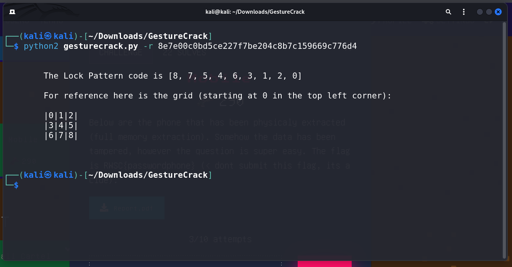

# Mobile CTF Challenge Writeup

## Challenge Information
- **Name**: Mobile
- **Points**: 290
- **Category**: DFIR (Digital Forensics and Incident Response)
- **Objective**: The challenge involves extracting information from a PDF document related to mobile forensics.

## Solution
Here's a brief overview of the solution for the Mobile CTF challenge:

1. **Initial Approach**:
   - Started by examining the 3000-page PDF document provided for any visible clues or patterns.
   - Noticed that certain pages were scribbled over, indicating potential hidden information.

        

2. **Extraction Attempt**:
   - Used `pdfimages` tool to extract images from the PDF, hoping to find hidden messages or flags.
   - However, this approach did not yield any relevant information.
   - If you are curious, they are confidential information such as IC, BankRakyat Account Information, etc

3. **Identification of Suspicious Content**:
   - Continued to carefully review the PDF document.
   - Noticed a suspicious SHA-1 hash that was out of place and bolded, hinting at its significance.

      

4. **Hint from Social Media**:
   - Recalled a hint from Twitter related to Android hacking and cracking gesture passwords.
   - Realized that the SHA-1 hash resembled the format of the hash mentioned in the hint.

5. **Decryption Attempt**:
   - Researched tools and methods for decrypting SHA-1 hashes associated with Android gesture passwords.
   - Found a Python script on GitHub that seemed promising for this purpose.

6. **Successful Decryption**:
   - Applied the Python script to decrypt the SHA-1 hash found in the PDF.
   - The decrypted value revealed the flag, solving the challenge.

      

## Conclusion
The Mobile CTF challenge involved extracting a hidden flag from a large PDF document related to mobile forensics. Despite initial attempts to extract information from the PDF images, the solution was found in a suspicious SHA-1 hash within the document. By decrypting this hash using a Python script, the flag was successfully obtained, completing the challenge.

## Notes for this challenge

Despite the gruesome challenge, there were highlights that are worth mentioning. Attached below are my favourite parts of this challenge. 

   

   

   

  