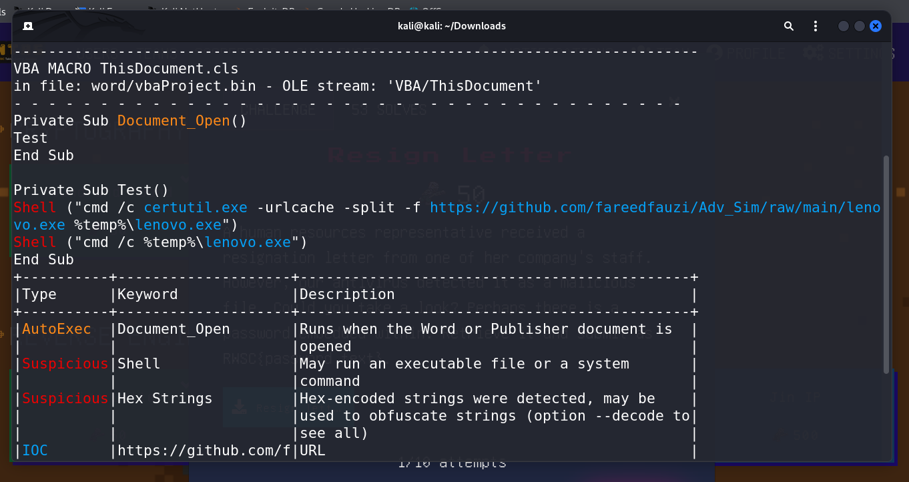
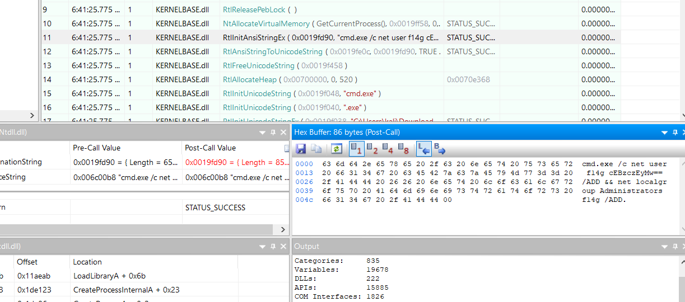
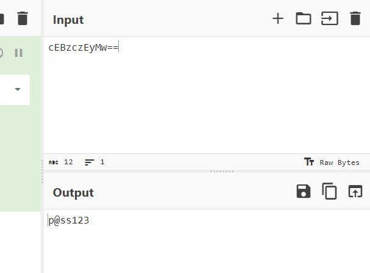

# Resign Letter CTF Challenge Writeup

## Challenge Information
- **Name**: Resign Letter
- **Points**: 50
- **Category**: Reverse Engineering
- **Objective**: The challenge involves analyzing a Word document to extract and analyze a suspicious executable file.

## Solution
Here's a detailed solution for the Resign Letter CTF challenge:

1. **Initial Assessment**:
   - Analyzed the provided Word document for any embedded macros using olevba.
   - Identified a suspicious link within the document.

      

2. **Analysis of the Executable**:
   - Downloaded and extracted the executable, named `lenovo.exe`.
   - Ran the executable in a Windows virtual machine for analysis.

3. **Dynamic Analysis**:
   - Initially used Procmon for monitoring file system activity but found it challenging due to the hidden modifications.
   - Switched to API Monitor for more detailed monitoring.

4. **Identifying the Flag**:
   - Analyzed the API calls made by the executable using API Monitor.
   - Discovered the flag being accessed or manipulated by the executable.

      

      

## Conclusion
The Resign Letter CTF challenge required reverse engineering skills to analyze a Word document and a Windows executable. By using tools like olevba for macro analysis and API Monitor for dynamic analysis of the executable, the flag was successfully extracted. This challenge highlighted the importance of understanding malware analysis techniques for identifying malicious behavior.