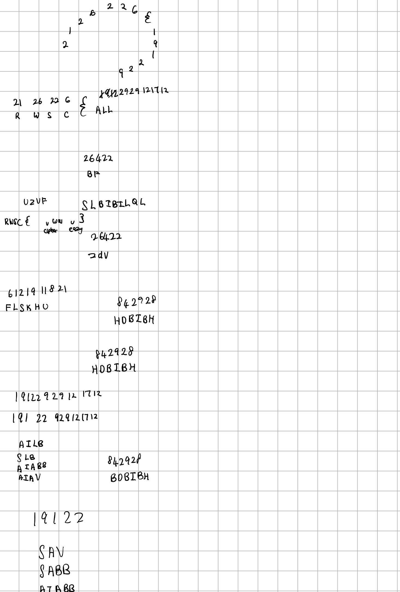

# Round and Round CTF Challenge Writeup

## Challenge Information
- **Name**: Round and Round
- **Points**: 50
- **Category**: Cryptography
- **Objective**: The challenge involves decrypting a given ciphertext to obtain the flag.

## Solution
Here's a detailed solution for the Round and Round CTF challenge:

1. **Initial Assessment**:
   - Examined the given ciphertext but was unsure of the encryption method used.

2. **Observations and Strategy**:
   - It took me long to notice that the ciphertext seemed to resemble ASCII values or character mappings.
   - Attempted to place the flag format, `RWSC{`, under the ciphertext to see if any patterns emerged.

3. **Decryption Process**:
   - For example, 21 corresponds to 'R', 26 corresponds to 'W', and so on.
   - Used this pattern to decode each number in the ciphertext to its corresponding character.
   - But there is a gimmick, I eventually found out that if numbers were less than 30 were being wrapped around.
   - This is a very stupid gimmick to be honest, since the flag cannot be constructed without knowing this. 

      

4. **Flag Decryption**:
   - Decrypted the entire ciphertext using the wrapping pattern to reveal the flag.
   - The flag is also in upper-case.

## Conclusion
The Round and Round CTF challenge required understanding a specific wrapping pattern to decrypt the given ciphertext. By recognizing the pattern and applying it to the ciphertext, the flag was successfully decrypted. This challenge demonstrated the importance of pattern recognition and creative thinking in cryptography challenges.