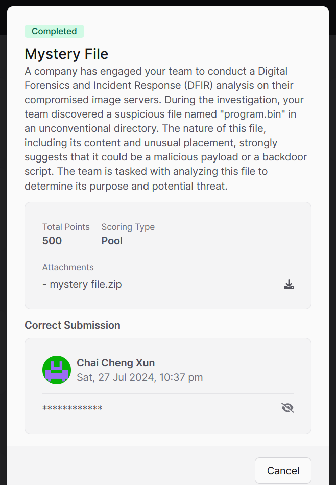
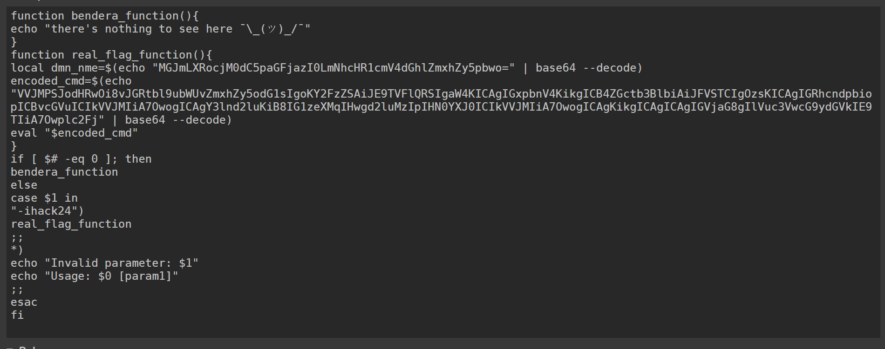
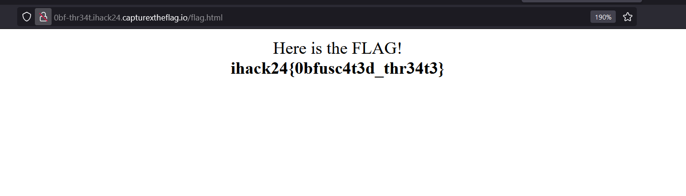

# Mystery File CTF Challenge Writeup

## Challenge Information
- **Name**: Mystery File
- **Points**: 500
- **Category**: DFIR (Digital Forensics and Incident Response)
- **Objective**: Deobfuscate a script within a ZIP file to uncover a domain and retrieve the flag from the associated webpage.

## Solution
To solve the "Mystery File" challenge, follow these steps:

1. **Initial Analysis**:
   - We are given a file named `program.bin`.
   - Use the `file` command to identify the nature of the file, which reveals it is a ZIP archive.

      

2. **Extracting the ZIP File**:
   - Unzip `program.bin` to obtain its contents, which include a large, obfuscated Bash script.

      

3. **Running the Script**:
   - To handle the obfuscation, use an online Bash interpreter such as [TIO.run](https://tio.run/#bash) to execute the script.
   - The initial execution of the script shows no useful output.

      

4. **Deobfuscating the Script**:
   - Modify the script to replace `eval` with `echo`. This allows you to see the script's output, revealing a new, similarly obfuscated Bash script.
   - Repeat the process of replacing `eval` with `echo` to progressively reveal less obfuscated versions of the script.

      

5. **Uncovering the Domain and Flag Location**:
   - After several iterations, the script becomes sufficiently deobfuscated to understand its content.
   - The script contains two base64 encoded strings. Decode the first string to reveal a domain name.
   - Decode the second string to find the URL where the flag can be obtained.

      

      

6. **Retrieving the Flag**:
   - Visit the webpage indicated by the decoded domain to locate and extract the flag.

      

7. **Flag**: **ihack24{0bfusc4t3d_thr34t3}**